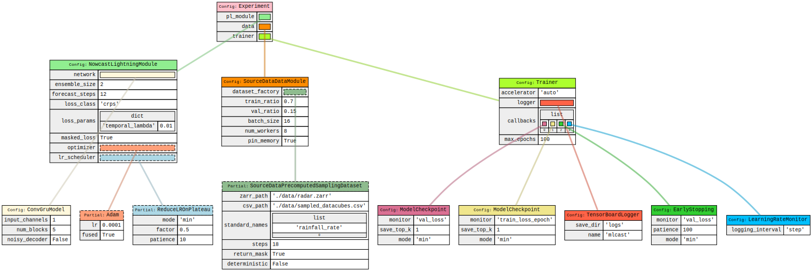
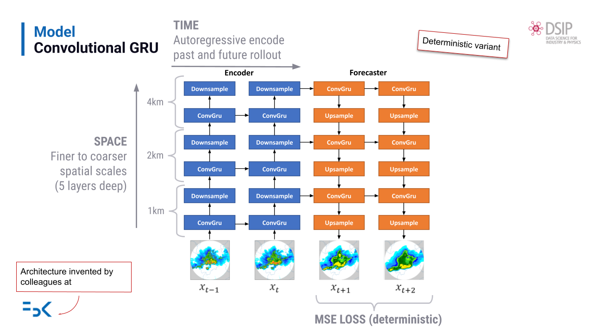
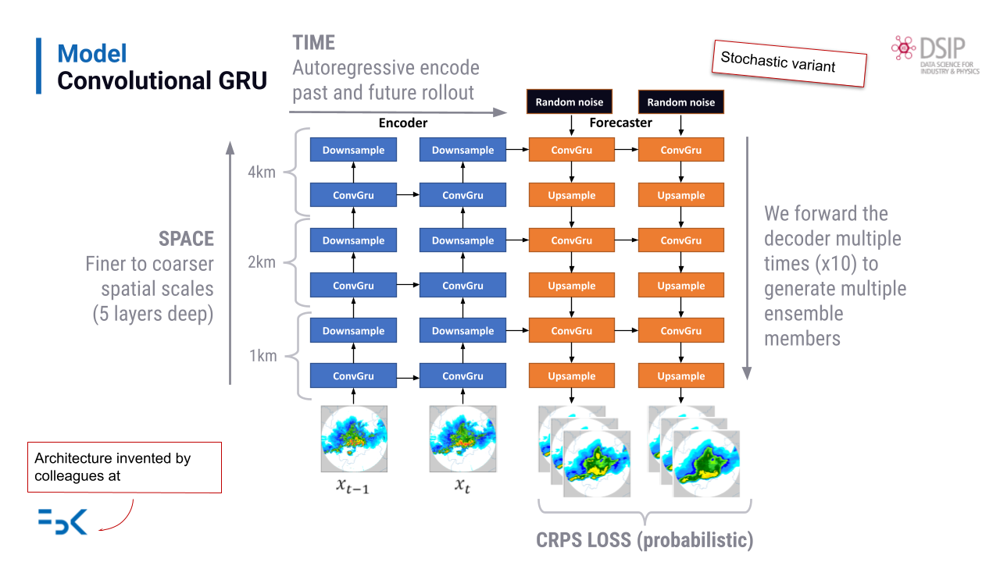

# mlcast

<!-- SPDX-License-Identifier: Apache-2.0 OR BSD-3-Clause -->

> ⚠️ This package is under active development. The API and functionality are subject to change until the v1.0.0 release.

The MLCast Community is a collaborative effort bringing together meteorological services, research institutions, and academia across Europe to develop a unified Python package for AI-based nowcasting. This is an initiative of the E-AI WG6 (Nowcasting) of EUMETNET.

This repo contains the `mlcast` package for machine learning-based weather nowcasting.

## Installation

mlcast is in rapid development — the recommended path is to run directly from
GitHub or clone locally, rather than installing a pinned release from PyPI.

### Recommended: run from GitHub with uvx (no local clone needed)

```bash
uvx --from git+https://github.com/mlcast-community/mlcast mlcast train
```

### Recommended: clone and install locally with uv

[Fork the repository](https://github.com/mlcast-community/mlcast/fork) on GitHub first, then clone your fork. This lets you track
upstream changes while keeping your own modifications on a separate branch:

```bash
git clone https://github.com/<your-github-username>/mlcast
cd mlcast

# CPU
uv sync

# GPU — CUDA 12.8
uv sync --extra gpu-cu128

# GPU — CUDA 13.0
uv sync --extra gpu-cu130
```

### PyPI release (pinned, stable)

A tagged release is published to PyPI and can be installed with pip, but it may
lag behind active development:

```bash
pip install mlcast
```

### Developing

If you intend to modify the code, clone locally as above and additionally
install the pre-commit hooks:

```bash
# Install uv if not already installed
curl -LsSf https://astral.sh/uv/install.sh | sh

# Install dev dependencies
uv sync --extra dev

# Install the pre-commit git hook (runs checks automatically on every commit)
uv run pre-commit install
```

## Usage

mlcast exposes two interfaces for training: a **command-line interface (CLI)**
for interactive and scripted use, and a **Python API** for programmatic control.
Both are built on [Fiddle](https://github.com/google/fiddle) — a configuration
library that lets you build a full experiment graph, override any parameter, and
reproduce runs exactly from a saved YAML file.

### Configuration model

Training in mlcast is currently built around a single base configuration
function, [`training_experiment`](src/mlcast/config/base.py), which defines the
default ConvGRU ensemble nowcasting setup: dataset, data module, network,
Lightning module, and trainer. Rather than writing a new config from scratch,
the intended workflow is to start from this base and apply targeted
modifications:

- **`set:` overrides** — change a single scalar parameter (e.g. batch size,
  learning rate, number of epochs)
- **fiddlers** — apply a named mutator function that keeps multiple related
  parameters in sync (e.g. switching the dataset class, toggling masking,
  changing the logger)
- **direct graph edits** (Python API only) — replace a sub-object entirely,
  for example swapping in a different network architecture

Any combination of these can be layered on top of the base config, and the
fully resolved config is always saved to YAML alongside the training logs so
runs can be reproduced exactly.

The diagram below shows the full default config graph as built by
[`training_experiment`](src/mlcast/config/base.py):



### Command-line interface

Install the package and run:

```bash
mlcast train
```

This trains with the built-in [`training_experiment`](src/mlcast/config/base.py) defaults. All parameters
are controlled via `--config` flags:

| Prefix | Purpose | Example |
|--------|---------|---------|
| *(none)* | Use the built-in default config | `mlcast train` |
| `set:` | Override a single parameter | `--config set:data.batch_size=32` |
| `fiddler:` | Apply a semantic mutator (multi-param change) | `--config fiddler:use_random_sampler` |
| `config:` | Switch to a different `@auto_config` function | `--config=config:my_experiment` |
| `path/to/config.yaml` | Load a previously saved config | `--config saved.yaml` |

Multiple `--config` flags are applied in order and can be combined freely.

**Examples:**

```bash
# Override dataset path and batch size
mlcast train \
    --config set:data.dataset_factory.zarr_path=/data/radar.zarr \
    --config set:data.batch_size=32

# Switch to random sampler and log to MLflow
mlcast train \
    --config fiddler:use_random_sampler \
    --config fiddler:use_mlflow_logger

# Resume from a saved config with an epoch override
mlcast train \
    --config logs/mlcast/version_0/config.yaml \
    --config set:trainer.max_epochs=50

# Inspect the fully resolved config without starting training
mlcast train --config fiddler:use_random_sampler --print_config_and_exit
```

Run `mlcast train --help` for a full list of examples and available fiddlers.

### Python API

The Python API gives you full programmatic control over the config graph before
anything is instantiated.

**Run the default experiment with tweaks:**

```python
import fiddle as fdl
from mlcast.config import training_experiment, train_from_config
from mlcast.config.fiddlers import use_random_sampler

cfg = training_experiment.as_buildable()  # returns a fdl.Config graph — see src/mlcast/config/base.py

# Apply a fiddler to switch the dataset sampler
use_random_sampler(cfg)

# Override individual parameters directly on the config graph
cfg.data.batch_size = 32
cfg.trainer.max_epochs = 50

# Validates cross-parameter contracts, builds all objects, persists config
# YAML to the active logger, then calls trainer.fit() + trainer.test()
train_from_config(cfg)
```

**Custom network architecture:**

You can swap in any architecture by replacing `cfg.pl_module.network` with a
`fdl.Config` node.  The network must implement the nowcasting forward
interface — see [Custom network interface](#custom-network-interface) below.

As an example, here is how to wrap an
[mfai](https://github.com/meteofrance/mfai) `HalfUNet` (a plain single-step
U-Net) to satisfy the interface.  The wrapper channel-stacks the past frames
and runs the U-Net autoregressively for each requested forecast step:

> **Note** — `past_steps` is not a top-level config parameter; it equals
> `dataset_factory.steps - pl_module.forecast_steps` (18 − 12 = 6 by
> default).  You must read it from the config before building the network
> node, as shown below.

```python
import fiddle as fdl
import torch
import torch.nn as nn
from jaxtyping import Float
from mfai.torch.models import HalfUNet
from mlcast.config import training_experiment, train_from_config
from mlcast.config.fiddlers import use_random_sampler

# Minimal adapter: channel-stack past frames → HalfUNet → one step at a time.
# NowcastLightningModule calls network(x, steps=N, ensemble_size=M), so any
# custom network must accept those keyword arguments.
class HalfUNetNowcaster(nn.Module):
    def __init__(self, in_channels: int = 6, out_channels: int = 1):
        super().__init__()
        self.unet = HalfUNet(
            input_shape=(256, 256),
            in_channels=in_channels,
            out_channels=out_channels,
            settings=fdl.Config(HalfUNet.settings_kls),
        )

    def forward(
        self,
        x: Float[torch.Tensor, "batch past_steps in_channels H W"],
        steps: int,
        ensemble_size: int = 1,
    ) -> Float[torch.Tensor, "batch steps out_channels H W"]:
        B, T, C, H, W = x.shape
        # channel-stack all past frames: [B, T*C, H, W]
        x_flat = x.reshape(B, T * C, H, W)
        preds = []
        for _ in range(steps):
            y = self.unet(x_flat)   # [B, out_channels, H, W]
            preds.append(y.unsqueeze(1))
            # slide window: drop oldest frame, append latest prediction
            x_flat = torch.cat([x_flat[:, C:], y], dim=1)
        return torch.cat(preds, dim=1)

cfg = training_experiment.as_buildable()
use_random_sampler(cfg)

past_steps = cfg.data.dataset_factory.steps - cfg.pl_module.forecast_steps
cfg.pl_module.network = fdl.Config(
    HalfUNetNowcaster,
    in_channels=past_steps * 1,  # 1 variable (rainfall_flux)
    out_channels=1,
)

train_from_config(cfg)
```

For lower-level control you can call the steps of `train_from_config` individually:

```python
import fiddle as fdl
from mlcast.config.consistency_checks import validate_config

validate_config(cfg)          # raises ValueError on any contract violation
experiment = fdl.build(cfg)   # instantiates all objects
experiment.run()              # trainer.fit() + trainer.test()
```

### Available fiddlers

| Fiddler | Arguments | What it does |
|---------|-----------|--------------|
| `use_mlflow_logger` | *(none)* | Replaces the default `TensorBoardLogger` with `MLFlowLogger` and appends `LogSystemInfoCallback`; respects the `MLFLOW_TRACKING_URI` environment variable |
| `set_variables` | `standard_names` | Sets the list of input variables on the dataset and updates `network.input_channels` to match |
| `toggle_masking` | `enabled` | Toggles masked-loss mode by setting both `dataset_factory.return_mask` and `pl_module.masked_loss` to the same value |
| `use_anon_s3_dataset` | `zarr_path`, `endpoint_url` | Points the dataset at an anonymous S3 object store; sets `zarr_path` and the required `storage_options` together |
| `use_random_sampler` | *(none)* | Switches the dataset factory to the on-the-fly random sampler (useful during development when no precomputed CSV is available) |

## Project Structure

```
mlcast/
├── src/mlcast/
│   ├── __main__.py                      # CLI entry point (mlcast train)
│   ├── nowcasting_module.py             # Generic Lightning module for nowcasting
│   ├── losses.py                        # CRPS, AFCRPS, MSE loss functions
│   ├── callbacks.py                     # Training callbacks
│   ├── visualization.py                 # TensorBoard image logging helpers
│   ├── config/
│   │   ├── base.py                      # Default training_experiment @auto_config
│   │   ├── fiddlers.py                  # Semantic config mutators
│   │   ├── consistency_checks.py        # Cross-parameter validation
│   │   ├── loader.py                    # YAML config loader
│   │   └── orchestrator.py             # train_from_config, config persistence
│   ├── data/
│   │   ├── source_data_datamodule.py    # Lightning DataModule
│   │   ├── source_data_datasets.py      # Zarr-backed PyTorch datasets
│   │   └── normalization.py             # Normalisation registry
│   └── models/
│       └── convgru.py                   # ConvGRU encoder-decoder
├── tests/
├── pyproject.toml
└── README.md
```

## Implemented architectures

### ConvGruModel

`ConvGruModel` (in `src/mlcast/models/convgru.py`) is an **encoder-decoder**
architecture.  It is **not autoregressive at forecast time**: rather than
generating each forecast frame from the previous predicted frame, the decoder
performs a temporal roll-out entirely in **latent space** — the ConvGRU at
each spatial scale unrolls over `forecast_steps` steps driven by noise or
zeros, with its hidden state initialised from the encoder.  Forecast frames
are only materialised at the end, by upsampling the final decoder hidden
states back to the original spatial resolution.

**Encoding** — a stack of `EncoderBlock` layers unrolls a ConvGRU
sequentially over the `past_steps` real observed frames.  Each block halves
the spatial resolution via `PixelUnshuffle(2)`.  The last hidden state of
each block is retained.

**Decoding** — a stack of `DecoderBlock` layers performs a latent-space
roll-out at each spatial scale.  Each decoder block's ConvGRU is initialised
with the final hidden state from the corresponding encoder block, then unrolls
over `forecast_steps` steps with noise or zeros as input — so the forecast
sequence emerges from the evolution of hidden states across multiple spatial
scales, never from feeding predictions back as inputs.  Spatial resolution is
doubled at each block via `PixelShuffle(2)`.

**Ensemble** — when `ensemble_size > 1` the decoder is run `ensemble_size`
times, each time with freshly sampled Gaussian noise.  The results are
concatenated along the channel dimension.

**Deterministic variant** ([diagram source](https://docs.google.com/presentation/d/1U2Y9vZADXTsgQBNiWYAgOwYeMPVu7TOk/edit?slide=id.p6#slide=id.p6)):



**Stochastic / ensemble variant** ([diagram source](https://docs.google.com/presentation/d/1U2Y9vZADXTsgQBNiWYAgOwYeMPVu7TOk/edit?slide=id.p7#slide=id.p7)):



`past_steps` is derived at runtime from the data config:
```
past_steps = dataset_factory.steps - pl_module.forecast_steps
           = 18 - 12 = 6  (defaults)
```

### Custom network interface

Any network architecture can be used by replacing `cfg.pl_module.network`
with a `fdl.Config` node pointing at your class.  The only requirement is
that `forward` accepts the following signature:

```python
# from jaxtyping import Float
# import torch

def forward(
    self,
    x: Float[torch.Tensor, "batch past_steps in_channels H W"],
    steps: int,          # number of forecast steps to produce
    ensemble_size: int,  # number of stochastic ensemble members
) -> Float[torch.Tensor, "batch steps out_channels H W"]:
    ...
```

If your network uses a different parameter name for the input channel count
than `input_channels` (the default assumed by `ConvGruModel` and the
`set_variables` fiddler), set it explicitly on the config node.

## Contributing

Please feel free to raise issues or PRs if you have any suggestions or questions.

## Links to presentations for discussion about the API

- [2025/02/04 first design discussions](https://docs.google.com/presentation/d/1oWmnyxOfUMWgeQi0XyX4fX9YDMX1vl6h/edit?usp=drive_link&rtpof=true&sd=true)

## License

This project is dual-licensed under either:

* Apache License, Version 2.0 ([LICENSE-APACHE](LICENSE-APACHE) or http://www.apache.org/licenses/LICENSE-2.0)
* BSD 3-Clause License ([LICENSE-BSD](LICENSE-BSD) or https://opensource.org/licenses/BSD-3-Clause)

at your option.

See [LICENSE](LICENSE) for more details.
