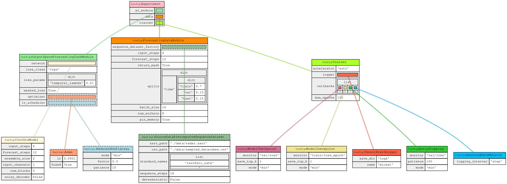
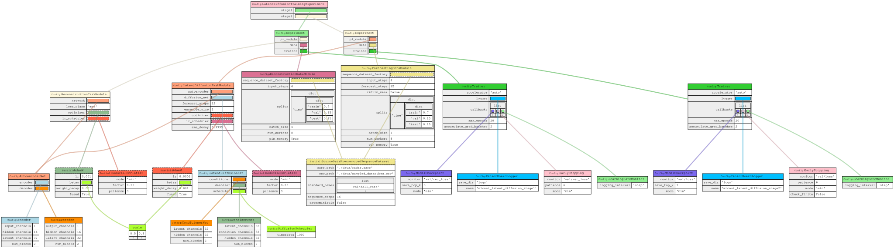
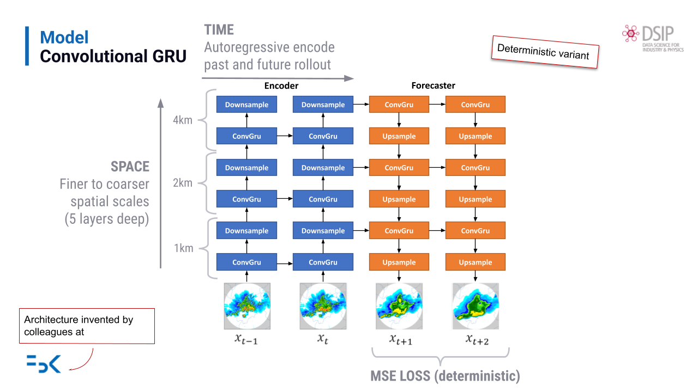
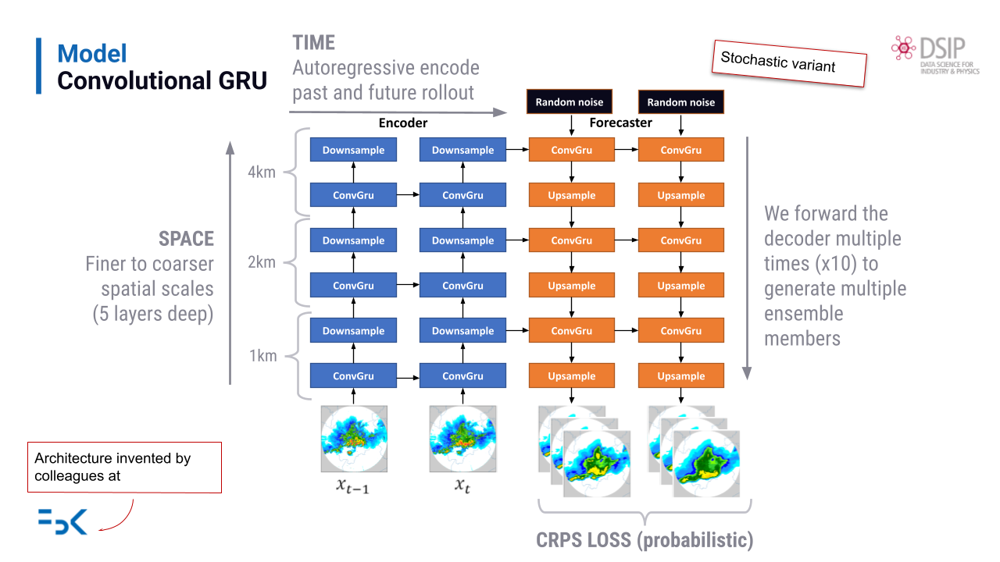

# mlcast

<!-- SPDX-License-Identifier: Apache-2.0 OR BSD-3-Clause -->

> ⚠️ This package is under active development. The API and functionality are subject to change until the v1.0.0 release.

The MLCast Community is a collaborative effort bringing together meteorological services, research institutions, and academia across Europe to develop a unified Python package for AI-based nowcasting. This is an initiative of the E-AI WG6 (Nowcasting) of EUMETNET.

This repo contains the `mlcast` package for machine learning-based weather nowcasting.

## Installation

As `mlcast` is in rapid development — the recommended path is to clone locally,
rather than installing a pinned release from PyPI.

### Local development: clone and install locally with uv

[Fork the repository](https://github.com/mlcast-community/mlcast/fork) on GitHub first, then clone your fork. This lets you track
upstream changes while keeping your own modifications on a separate branch:

```bash
git clone https://github.com/<your-github-username>/mlcast
cd mlcast

# Install uv if not already installed
curl -LsSf https://astral.sh/uv/install.sh | sh

# And install depencies, depending on whether you have a GPU available.
# CPU
uv sync

# GPU — CUDA 12.8
uv sync --extra gpu-cu128

# GPU — CUDA 13.0
uv sync --extra gpu-cu130
```

Next you can jump to [using mlcast](#usage) or, if you intend to modify the code, setup the development toolchain as described below:

```bash

# Install dev dependencies
uv sync --extra dev

# Install the pre-commit git hook (runs checks automatically on every commit)
uv run pre-commit install
```

### PyPI release (pinned, stable)

Tagged releases have been published to PyPI and can be installed with pip, but recent changes mean that the CLI and API have changed significantly since the last release (`v0.0.1` as of writing), so this is not recommended for users who want to follow the latest development.

```bash
pip install mlcast
```

Note: The usage instructions below don't match the most recent pypi release (`v0.0.1a4` as of writing).

## Usage

mlcast exposes two interfaces for training: a **command-line interface (CLI)**
for interactive and scripted use, and a **Python API** for programmatic control.
Both are built on [Fiddle](https://github.com/google/fiddle) — a configuration
library that lets you build a full experiment graph, override any parameter, and
reproduce runs exactly from a saved YAML file.

### Configuration model

mlcast ships with two included configuration functions:

- [`convgru_training_experiment`](src/mlcast/config/archetype/convgru.py) — defines a
  single-stage ConvGRU ensemble nowcasting setup (dataset, data module, network,
  Lightning module, trainer).
- [`latent_diffusion_experiment`](src/mlcast/config/archetype/latent_diffusion.py) — defines a
  two-stage latent diffusion setup: stage 1 trains an autoencoder on reconstruction
  windows, stage 2 trains a latent diffusion model on the same autoencoder's
  latent space.

Rather than writing a new config from scratch, the intended workflow is to
start from one of these configs and apply targeted modifications:

- **`set:` overrides** — change a single scalar parameter (e.g. batch size,
  learning rate, number of epochs)
- **fiddlers** — apply a named mutator function that keeps multiple related
  parameters in sync (e.g. switching the dataset class, toggling masking,
  changing the logger)
- **direct graph edits** (Python API only) — replace a sub-object entirely,
  for example swapping in a different network architecture

Any combination of these can be layered on top of the selected config, and the
fully resolved config is always saved to YAML alongside the training logs so
runs can be reproduced exactly.

The diagrams below show the full included config graphs.

**convgru_training_experiment:**



**latent_diffusion_experiment:**



### Design roles

mlcast separates pure architectures from task-level training wrappers.

- `src/mlcast/models/`
  Pure `torch.nn.Module` architectures and supporting components. These classes
  define tensor transformations and reusable building blocks, but they do not
  decide how training is run or which parameters are optimized.
- `src/mlcast/modules/`
  Task-level Lightning modules. These classes define what batch structure a
  task consumes, what loss is computed, which parameters are optimized, and how
  inference/prediction is exposed.

In other words, architectures answer "how does this tensor get transformed?",
while task modules answer "what is being trained, against what target, and over
which parameters?"

This distinction matters especially for latent diffusion. The diffusion
architecture itself lives under `models/`, while the corresponding task module
owns the trained autoencoder reuse policy, decides that only diffusion-network
parameters are optimized, computes diffusion loss in latent space, and handles
decoded forecast inference.

### Command-line interface

Install the package and run:

```bash
# Single-stage ConvGRU nowcasting
mlcast train --config config:convgru_training_experiment
# Two-stage latent diffusion

mlcast train --config config:latent_diffusion_experiment
```

All parameters are controlled via `--config` flags:

| Prefix | Purpose | Example |
|--------|---------|---------|
| `config:` | Select an included `@auto_config` function | `--config config:convgru_training_experiment` or `--config config:latent_diffusion_experiment` |
| `set:` | Override a single parameter | `--config set:data.batch_size=32` |
| `fiddler:` | Apply a semantic mutator (multi-param change) | `--config fiddler:use_random_sampler` |
| `path/to/config.yaml` | Load a previously saved config | `--config saved.yaml` |

Multiple `--config` flags are applied in order and can be combined freely.

**Examples:**

```bash
# Override dataset path and batch size
mlcast train \
    --config config:convgru_training_experiment \
    --config set:data.sequence_dataset_factory.zarr_path=/data/radar.zarr \
    --config set:data.batch_size=32

# Switch to random sampler and log to MLflow
mlcast train \
    --config config:convgru_training_experiment \
    --config fiddler:use_random_sampler \
    --config fiddler:use_mlflow_logger

# Resume from a saved config with an epoch override
mlcast train \
    --config logs/mlcast/version_0/config.yaml \
    --config set:trainer.max_epochs=50

# Run two-stage latent diffusion training with a shorter diffusion schedule

    --config config:latent_diffusion_experiment \
    --config set:stage2.pl_module.diffusion_net.scheduler.timesteps=20

# Inspect the fully resolved config without starting training
mlcast train --config config:convgru_training_experiment --config fiddler:use_random_sampler --print_config_and_exit
```

Run `mlcast train --help` for a full list of examples and available fiddlers.

### Python API

The Python API gives you full programmatic control over the config graph before
anything is instantiated.

**Run the included ConvGRU experiment with tweaks:**

```python
import fiddle as fdl
from mlcast.config import convgru_training_experiment, train_from_config
from mlcast.config.fiddlers import use_random_sampler

cfg = convgru_training_experiment.as_buildable()  # returns a fdl.Config graph — see src/mlcast/config/archetype/convgru.py

# Apply a fiddler to switch the dataset sampler
use_random_sampler(cfg)

# Override individual parameters directly on the config graph
cfg.data.batch_size = 32
cfg.trainer.max_epochs = 50

# Validates cross-parameter contracts, builds all objects, persists config
# YAML to the active logger, then calls trainer.fit() + trainer.test()
train_from_config(cfg)
```

**Run the included latent diffusion experiment with tweaks:**

```python
from mlcast.config import latent_diffusion_experiment, train_from_config
from mlcast.config.fiddlers import use_random_sampler

cfg = latent_diffusion_experiment.as_buildable()

# Applied once — @applies_to_experiments walks both stages automatically
use_random_sampler(cfg)

# Override the diffusion noise schedule
cfg.stage2.pl_module.diffusion_net.scheduler.timesteps = 20

# train_from_config applies to the full two-stage experiment
train_from_config(cfg)
```

**Custom network architecture:**

You can swap in any architecture by replacing `cfg.pl_module.network` with a
`fdl.Config` node.  The network must implement the nowcasting forward
interface — see [Custom network interface](#custom-network-interface) below.

As an example, here is how to wrap an
[mfai](https://github.com/meteofrance/mfai) `HalfUNet` (a plain single-step
U-Net) to satisfy the interface.  The wrapper channel-stacks the past frames
and runs the U-Net autoregressively for each requested forecast step:

> **Note** — `input_steps` equals the forecasting data module's `input_steps` (6 by
> default) and is directly readable from the config graph before building.

```python
import einops
import fiddle as fdl
import torch
import torch.nn as nn
from jaxtyping import Float
from mfai.torch.models import HalfUNet
from mlcast.config import convgru_training_experiment, train_from_config
from mlcast.config.fiddlers import use_random_sampler

# Minimal adapter: channel-stack past frames -> HalfUNet -> one step at a time.
# The forecasting contract fixes input_steps, forecast_steps, and ensemble_size
# at model initialization; this minimal deterministic adapter exposes one
# ensemble member and OutputSpaceForecastingTaskModule calls network(x).
class HalfUNetNowcaster(nn.Module):
    def __init__(self, input_steps: int = 6, forecast_steps: int = 12, num_vars: int = 1):
        super().__init__()
        self.input_steps = input_steps
        self.forecast_steps = forecast_steps
        self.num_vars = num_vars
        self.unet = HalfUNet(
            input_shape=(256, 256),
            in_channels=input_steps * num_vars,
            out_channels=num_vars,
            settings=fdl.Config(HalfUNet.settings_kls),
        )

    @property
    def ensemble_size(self) -> int:
        return 1

    @property
    def input_channels(self) -> int:
        # Externally the model handles (batch, time, channels, height, width);
        # internally the U-Net channel-stacks time into (batch, time*channels, ...).
        # This property lets config consistency checks verify dataset-model agreement.
        return self.num_vars

    def forward(
        self,
        x: Float[torch.Tensor, "batch time channels height width"],
    ) -> Float[torch.Tensor, "batch forecast_steps ensemble_size out_channels height width"]:
        x_flat = einops.rearrange(x, "b t c h w -> b (t c) h w")
        preds = []
        for _ in range(self.forecast_steps):
            y = self.unet(x_flat)
            preds.append(y)
            x_flat = torch.cat([x_flat[:, self.num_vars:], y], dim=1)
        return einops.rearrange(torch.stack(preds, dim=1), "b t c h w -> b t 1 c h w")

cfg = convgru_training_experiment.as_buildable()
use_random_sampler(cfg)

cfg.pl_module.network = fdl.Config(
    HalfUNetNowcaster,
    input_steps=cfg.data.input_steps,
    forecast_steps=cfg.data.forecast_steps,
    num_vars=len(cfg.data.sequence_dataset_factory.standard_names),
)
# The base ConvGRU config uses CRPS for ensemble forecasts; this adapter is
# deterministic and exposes only one member, so use a deterministic loss.
cfg.pl_module.loss_class = "mse"
cfg.pl_module.loss_params = None

train_from_config(cfg)
```

For lower-level control you can call the steps of `train_from_config` individually:

```python
import fiddle as fdl
from mlcast.config.consistency_checks import validate_config

validate_config(cfg)          # raises ValueError on any contract violation
experiment = fdl.build(cfg)   # instantiates all objects
experiment.run()              # trainer.fit() + trainer.test()
```

### Available fiddlers

| Fiddler | Arguments | What it does |
|---------|-----------|--------------|
| `use_mlflow_logger` | *(none)* | Replaces the default `TensorBoardLogger` with `MLFlowLogger` and appends `LogSystemInfoCallback`; respects the `MLFLOW_TRACKING_URI` environment variable |
| `set_variables` | `standard_names` | Sets the list of input variables on the dataset and updates `network.input_channels` to match |
| `toggle_masking` | `enabled` | Toggles masked-loss mode by setting both `data.return_mask` and `pl_module.masked_loss` to the same value |
| `use_anon_s3_dataset` | `zarr_path`, `endpoint_url` | Points the dataset at an anonymous S3 object store; sets `zarr_path` and the required `storage_options` together |
| `use_random_sampler` | *(none)* | Switches the dataset factory to the on-the-fly random sampler (useful during development when no precomputed CSV is available) |

## Project Structure

```
mlcast/
├── src/mlcast/
│   ├── __main__.py                      # CLI entry point (mlcast train)
│   ├── nowcasting_module.py             # Generic Lightning module for nowcasting
│   ├── losses.py                        # CRPS, AFCRPS, MSE loss functions
│   ├── callbacks.py                     # Training callbacks
│   ├── visualization.py                 # TensorBoard image logging helpers
│   ├── config/
│   │   ├── base.py                      # Experiment dataclass
│   │   ├── archetype/
│   │   │   ├── convgru.py               # ConvGRU training config @auto_config
│   │   │   └── latent_diffusion.py      # Two-stage latent diffusion config @auto_config
│   │   ├── fiddlers.py                  # Semantic config mutators
│   │   ├── consistency_checks.py        # Cross-parameter validation
│   │   ├── loader.py                    # YAML config loader
│   │   └── orchestrator.py             # train_from_config, config persistence
│   ├── data/
│   │   ├── datamodules.py               # Lightning DataModules
│   │   ├── sequence.py                  # Zarr-backed sequence datasets
│   │   ├── forecasting.py               # Forecasting task dataset wrapper
│   │   ├── reconstruction.py            # Reconstruction task dataset wrapper
│   │   └── normalization.py             # Normalisation registry
│   ├── models/
│   │   ├── convgru.py                   # ConvGRU encoder-decoder
│   │   ├── autoencoder/
│   │   │   ├── encoder.py               # Encoder
│   │   │   ├── decoder.py               # Decoder
│   │   │   └── net.py                   # AutoencoderNet composition
│   │   └── diffusion/
│   │       ├── conditioner.py           # ConditionerNet (context builder)
│   │       ├── denoiser.py              # DenoiserUNet
│   │       ├── scheduler.py             # Diffusion noise scheduler
│   │       ├── sampler.py               # Inference-time sampling loop
│   │       ├── ema.py                   # EMA weight tracking
│   │       ├── loss.py                  # Diffusion loss
│   │       └── net.py                   # LatentDiffusionNet composition
│   └── modules/
│       ├── forecasting.py               # Base + OutputSpace + LatentDiffusion task modules
│       └── reconstruction.py            # ReconstructionTaskModule
├── tests/
├── pyproject.toml
└── README.md
```

## Implemented architectures

### ConvGruModel

`ConvGruModel` (in `src/mlcast/models/convgru.py`) is an **encoder-decoder**
architecture.  It is **not autoregressive at forecast time**: rather than
generating each forecast frame from the previous predicted frame, the decoder
performs a temporal roll-out entirely in **latent space** — the ConvGRU at
each spatial scale unrolls over `forecast_steps` steps driven by noise or
zeros, with its hidden state initialised from the encoder.  Forecast frames
are only materialised at the end, by upsampling the final decoder hidden
states back to the original spatial resolution.

**Encoding** — a stack of `EncoderBlock` layers unrolls a ConvGRU
sequentially over the `input_steps` real observed frames.  Each block halves
the spatial resolution via `PixelUnshuffle(2)`.  The last hidden state of
each block is retained.

**Decoding** — a stack of `DecoderBlock` layers performs a latent-space
roll-out at each spatial scale.  Each decoder block's ConvGRU is initialised
with the final hidden state from the corresponding encoder block, then unrolls
over `forecast_steps` steps with noise or zeros as input — so the forecast
sequence emerges from the evolution of hidden states across multiple spatial
scales, never from feeding predictions back as inputs.  Spatial resolution is
doubled at each block via `PixelShuffle(2)`.

**Ensemble** — when `ensemble_size > 1` the decoder is run `ensemble_size`
times, each time with freshly sampled Gaussian noise.  The results are
stacked along an explicit ensemble dimension, giving the final shape
`(batch, forecast_steps, ensemble_size, channels, height, width)`.

**Deterministic variant** ([diagram source](https://docs.google.com/presentation/d/1U2Y9vZADXTsgQBNiWYAgOwYeMPVu7TOk/edit?slide=id.p6#slide=id.p6)):



**Stochastic / ensemble variant** ([diagram source](https://docs.google.com/presentation/d/1U2Y9vZADXTsgQBNiWYAgOwYeMPVu7TOk/edit?slide=id.p7#slide=id.p7)):




### LatentDiffusionNet (two-stage latent diffusion)

This is a **two-stage** latent diffusion nowcasting system. Stage 1 trains an
autoencoder on reconstruction windows; stage 2 trains a latent diffusion model
that forecasts in the autoencoder's latent space and decodes forecasts back to
data space.

The architecture components live under `src/mlcast/models/autoencoder/` and
`src/mlcast/models/diffusion/`. The task-level Lightning modules live under
`src/mlcast/modules/` and are wired together by
[`latent_diffusion_experiment`](src/mlcast/config/archetype/latent_diffusion.py).

#### Stage 1 — Autoencoder reconstruction

The autoencoder is built from an
[`Encoder`](src/mlcast/models/autoencoder/encoder.py) and
[`Decoder`](src/mlcast/models/autoencoder/decoder.py), composed by
[`AutoencoderNet`](src/mlcast/models/autoencoder/net.py).

- **Encoder** — a stack of `EncoderBlock` layers. Each block downsamples
  spatial resolution via strided 3D convolution and doubles the channel count.
  The final output is a latent tensor with shape
  `(batch, latent_channels, time, latent_height, latent_width)`.
- **Decoder** — a stack of `DecoderBlock` layers that mirror the encoder. Each
  block upsamples spatial resolution via transposed 3D convolution and halves
  the channel count, reconstructing the original input shape.

The autoencoder is trained on overlapping temporal windows via
[`ReconstructionDataset`](src/mlcast/data/reconstruction.py) and
[`ReconstructionDataModule`](src/mlcast/data/datamodules.py). The
[`ReconstructionTaskModule`](src/mlcast/modules/reconstruction.py) optimises
the full autoencoder parameters against an MSE reconstruction loss.

#### Stage 2 — Latent diffusion forecasting

The latent diffusion model is built from a
[`ConditionerNet`](src/mlcast/models/diffusion/conditioner.py),
[`DenoiserUNet`](src/mlcast/models/diffusion/denoiser.py), and
[`DiffusionScheduler`](src/mlcast/models/diffusion/scheduler.py), composed by
[`LatentDiffusionNet`](src/mlcast/models/diffusion/net.py).

- **ConditionerNet** — projects encoded input-history latents through a series
  of residual 3D convolution blocks to produce a conditioning context for the
  denoiser U-Net. This answers "what did the recent past look like in latent
  space?"
- **DenoiserUNet** — a timestep-aware U-Net with 3D convolutions over the
  latent spatial dimensions (time dimension is preserved). It receives the
  noisy target latent, a diffusion timestep embedding (sinusoidal), and the
  conditioning context from the conditioner. The U-Net predicts the additive
  noise (`eps` parameterization) that was applied to reach the current
  timestep.
- **DiffusionScheduler** — defines the forward diffusion noise schedule
  (linear beta schedule by default) and provides the pre-computed alpha/beta
  buffers used by the forward and reverse processes.

Training uses a standard MSE diffusion loss (`DiffusionLoss` in
`src/mlcast/models/diffusion/loss.py`): for each batch the input is encoded
with the trained (frozen) encoder, the target is encoded with the same encoder,
a random timestep is drawn per sample, noise is added to the target latents,
and the denoiser is trained to predict the added noise.

Inference uses a [`DiffusionSampler`](src/mlcast/models/diffusion/sampler.py)
to progressively denoise random latents conditioned on encoded input history.
The reverse diffusion loop steps backward through the schedule, and the final
denoised latent is decoded back to data space by the trained decoder, giving
an explicit ensemble dimension in the output shape
`(batch, forecast_steps, ensemble_size, channels, height, width)`. When
`ensemble_size > 1`, the process is repeated with fresh noise and the results
are stacked.

#### Two-stage training experiment

The [`latent_diffusion_experiment`](src/mlcast/config/archetype/latent_diffusion.py) auto-config
orchestrates both stages:

- Stage 1 builds a `ReconstructionDataModule`, `AutoencoderNet`, and
  `ReconstructionTaskModule`, then calls `trainer.fit() + trainer.test()`.
- Stage 2 reuses the **same trained autoencoder instance** (Fiddle graph
  identity sharing), builds a `ForecastingDataModule` and
  `LatentDiffusionTaskModule`, then calls `trainer.fit() + trainer.test()`.
- The stage-2 module freezes the autoencoder on `fit_start` and optimises only
  the diffusion-network parameters.


### Custom network interface

Any network architecture can be used by replacing `cfg.pl_module.network`
with a `fdl.Config` node pointing at your class. Forecasting models should set
`input_steps`, `forecast_steps`, and `ensemble_size` during initialization. The
only runtime `forward` requirement is:

```python
# from jaxtyping import Float
# import torch

def forward(
    self,
    x: Float[torch.Tensor, "batch input_steps in_channels H W"],
) -> Float[torch.Tensor, "batch forecast_steps ensemble_size out_channels H W"]:
    ...
```

The output has an explicit ensemble dimension. For deterministic models
(`ensemble_size=1`) this dimension is 1. If a loss function operates over
the full forecast tensor without splitting ensemble members (e.g. MSE on
the ensemble mean), the task module handles reshaping automatically.

If your network uses a different parameter name for the input channel count
than `input_channels` (the default assumed by `ConvGruModel` and the
`set_variables` fiddler), set it explicitly on the config node.

## Contributing

Please feel free to raise issues or PRs if you have any suggestions or questions.

## Links to presentations for discussion about the API

- [2025/02/04 first design discussions](https://docs.google.com/presentation/d/1oWmnyxOfUMWgeQi0XyX4fX9YDMX1vl6h/edit?usp=drive_link&rtpof=true&sd=true)

## License

This project is dual-licensed under either:

* Apache License, Version 2.0 ([LICENSE-APACHE](LICENSE-APACHE) or http://www.apache.org/licenses/LICENSE-2.0)
* BSD 3-Clause License ([LICENSE-BSD](LICENSE-BSD) or https://opensource.org/licenses/BSD-3-Clause)

at your option.

See [LICENSE](LICENSE) for more details.
